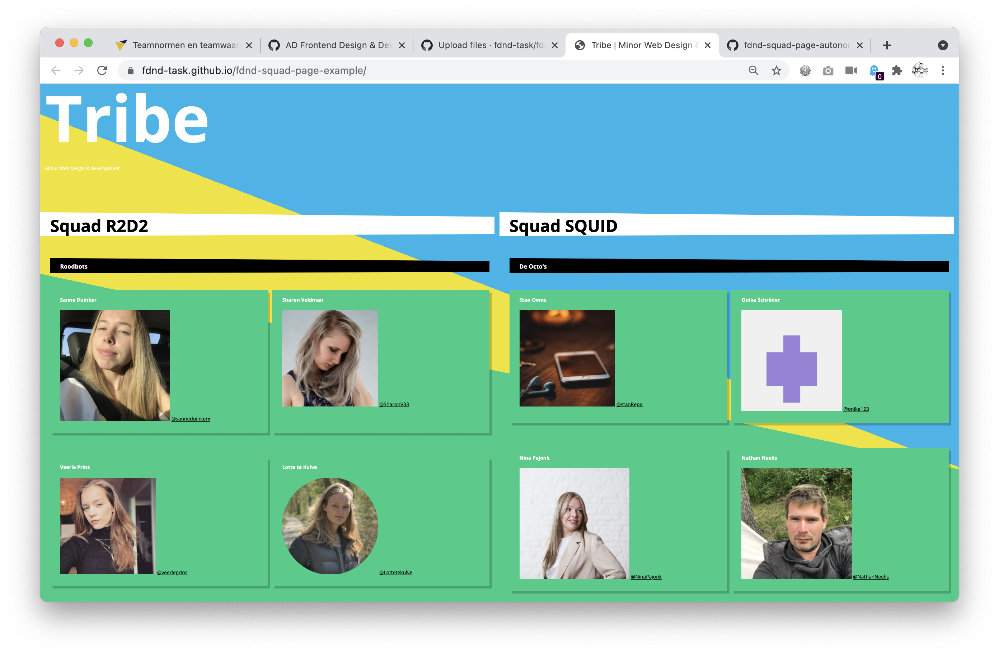

# Squad page

Je bestudeert het ontwerpen en maken van een squadpagina en bekijkt daarbinnen de semantiek in de HTML, de opmaak in CSS en de functionaliteit in Javascript.

## Context

Deze leertaak hoort bij sprint 1 "Your Tribe". Dit is een voorbeeld taak en wordt behandeld tijdens de workshops. Je kunt deze repository gebruiken om de onderwerpen nog eens rustig na te lezen.

## Briefing

Elke frontender bij FDND stelt zichzelf binnen de tribe voor door middel van een visitekaartje. Alle visitekaartjes worden verzameld in en overzichtspagina, dit noemen wij de squad-page. In dit voorbeeld zie je welke stappen je neemt bij het ontwerpen en maken van een overzichtspagina en hoe de HTML, CSS en JS er uit ziet.

## Doel van deze opdracht

Na het volgen van deze opdracht heb je een beginnend idee over samenwerken in teams en heb je de development lifecycle met een team toegepast.

## Werkwijze

Dit is een *voorbeeld* taak die wordt behandeld in de bijhorende talks en workshops. Deze opdracht gaat over alle fases van de DLC [analyseren](#analyseren), [ontwerpen](#ontwerpen), [bouwen](#bouwen), [integreren](#integreren) en [testen](#testen).

### Analyseren
In de analysefase inventariseer je wat er moet gebeuren om een taak uit te voeren en formuleer je een aantal uitgangspunten waar je ontwerp aan moet voldoen.

Aanpak

1. Lees de instructies van deze leertaak zorgvuldig door
2. Bekijk de verschillende fases van de Development Lifecycle en wat je per stap gaat doen
3. Bepsreek met jouw team wat je aan werk verwacht en maak aantekingen. (Wat komt je bekend voor, wat heb je al vaker gedaan of wat lijkt je lastig)

### Ontwerpen
Bij de start van de ontwerpfase weet je wat het doel en het resultaat van je project zijn. In de ontwerpfase neem je ontwerpbeslissingen en zorg je dat je precies weet wat je moet gaan bouwen.

Nu wordt het tijd om te kijken hoe het resultaat eruit zou kunnen zien. Dit is een belangrijk moment in het project. (Voor veel opdrachtgevers geldt dat ze nu pas duidelijk krijgen hoe het resultaat eruit zal zien. En dat is een moment waarop veel opdrachtgevers veel duidelijker kunnen aangeven wat ze wel en niet willen.)

Aanpak

1. Bekijk de visitekaartjes van jouw klasgenoten en benoem verschillen en overeenkomsten. Noteer deze op post-it notes.
2. Zoek individueel tenminste tien voorbeelden van overzichtspagina's en verzamel die gezamenlijk in Miro.
3. Schets individueel minstens tien manieren waarop je de overzichtspagina zou kunnen vormgeven.
4. Maak gezamenlijk een selectie van de drie beste schetsen.
5. Deel de drie schetsen met de squad door middel van een korte presentatie, vraag om feedback.
6. Maak een selectie, voeg eventueel schetsen samen, maak als team een definitieve schets.
  

#### Materiaal ontwerpfase

- Pen en papier
- Laptop (voor Miro)

  1. Inspiratie
- [Webdesign-inspiration.com](https://www.webdesign-inspiration.com/)
- [Awwwards.com](https://www.awwwards.com/95-inspiring-websites-of-web-design-agencies.html#google_vignette)
- [Team & About Pages @ Awwwards.com](https://www.awwwards.com/awwwards/collections/about-page/)
- [The Webby Awards](https://www.webbyawards.com/)
- [20 Best 'Meet the Team' Pages We've Ever Seen @ Hubspot](https://blog.hubspot.com/marketing/creative-agency-team-pages)
- [15 Kickass Meet the Team Pages You Need to Check Out @ BluLeadz](https://www.bluleadz.com/blog/10-kickass-meet-the-team-page-examples)
- [30 BEST MEET THE TEAM PAGES EXAMPLES AND TRENDS @ amasty](https://amasty.com/blog/30-best-meet-the-team-pages-examples-and-trends/)
  
 2. Schetsen
- [Artikel: The importance of sketching in web design](https://www.secretstache.com/blog/importance-sketching-web-design/)
- [Video: How To Sketch Wireframes—Web Design ](https://www.youtube.com/watch?v=ciL6FxkoLsw)

### Bouwen
In de bouwfase realiseer je de beslissingen uit de ontwerpfase in HTML, CSS en JS.

Op basis van je ontwerpschets ga je bedenken hoe je je ontwerp in code kan bouwen. Je zet je project op in Github en kopieert de repository naar jouw computer. Je begint met de content in HTML, voegt CSS toe voor de vormgeving en JS voor de interactie.

De code schrijf je in een code-editor zoals Visual Studio Code. Alle code van je project zet je op Github zodat docenten en studiegenoten kunnen zien wat je hebt gedaan.

Aanpak

1. {geef de stappen}
2. {die in deze fase}
3. {doorlopen worden}

#### Materiaal bouwfase

- [Resource](https://example.com)
- [Resource](https://example.com)
- [Resource](https://example.com)

### Integreren
In de integratiefase voer je de aanpassingen door zodat iedereen ze kan zien.

Eerst voeg je de nieuwe code toe aan je lokale repository zodat Github weet wat de nieuwste versie is. Daarna ga je de code uploaden naar de online repository op Github. Tot slot ga je je opdracht publiceren met behulp van Github Pages. Als je dat hebt gedaan staat je website online en hebb je een url, nu kunnen anderen je werk ook zien.

Aanpak

1. {geef de stappen}
2. {die in deze fase}
3. {doorlopen worden}

#### Materiaal integratiefase

- [Resource](https://example.com)
- [Resource](https://example.com)
- [Resource](https://example.com)

### Testen
*In de testfase controleer je of jouw aanpassingen werken zoals bedoeld.*

Aanpak

1. {geef de stappen}
2. {die in deze fase}
3. {doorlopen worden}

#### Materiaal testfase

- [Resource](https://example.com)
- [Resource](https://example.com)
- [Resource](https://example.com)

